# olist-ecommerce-analysis
E-commerce customer, order, delivery and seller analysis using Python, statistical testing and machine learning techniques.
📊 E-Commerce Customer Analytics Project
# Olist E-Commerce Analysis

## Project Overview

This project analyzes the Brazilian Olist e-commerce dataset to understand customer behavior, order patterns, delivery performance, seller performance, and customer satisfaction.

## Technologies Used

- Python
- Pandas
- NumPy
- Matplotlib
- Seaborn
- Plotly
- SciPy
- Scikit-Learn
- Google Colab

## Analysis Performed

### Exploratory Data Analysis (EDA)

- Customer behavior analysis
- Product and order analysis
- Delivery performance analysis
- Seller performance analysis

### Statistical Analysis

- T-Test
- ANOVA
- Correlation Analysis

### Machine Learning

- K-Means Clustering
- Elbow Method

## Key Insights

- Customer purchasing behavior patterns were identified.
- Delivery performance metrics were analyzed.
- Product category trends were explored.
- Regional differences were evaluated.
- Customer segmentation was performed using clustering techniques.

## Dashboard Screenshots

### Dashboard 1
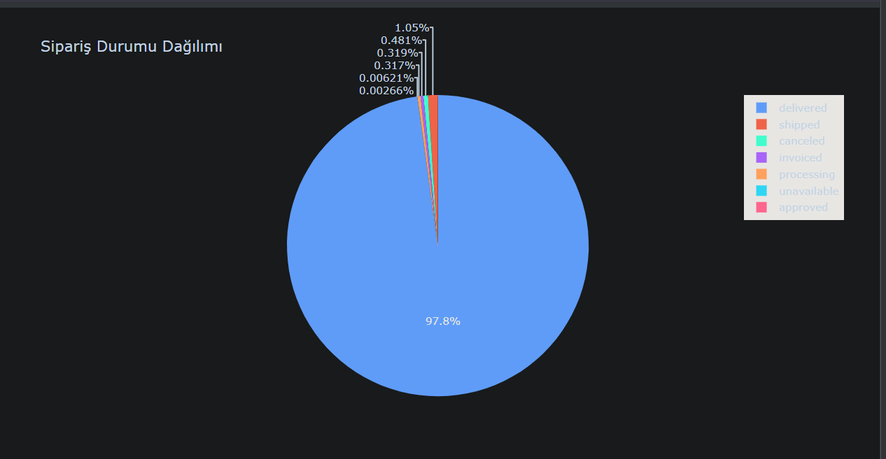

### Dashboard 2
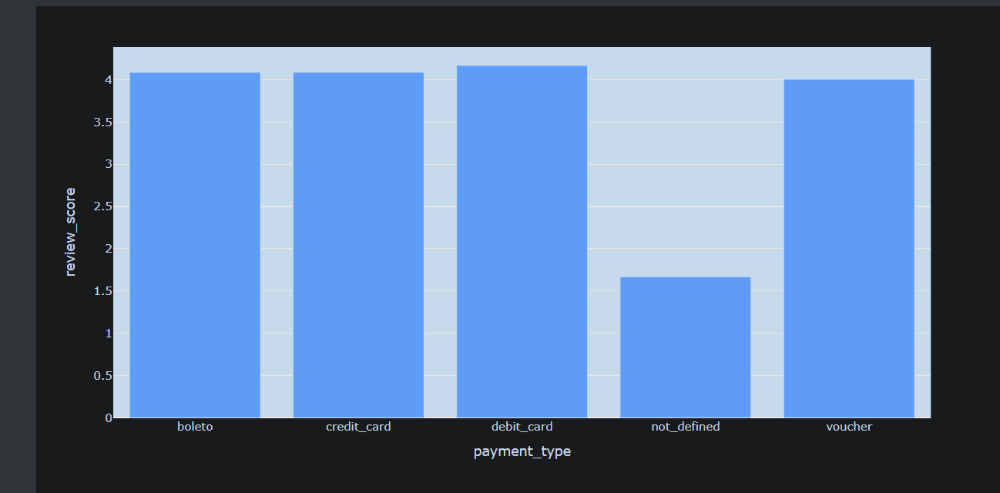

### Dashboard 3
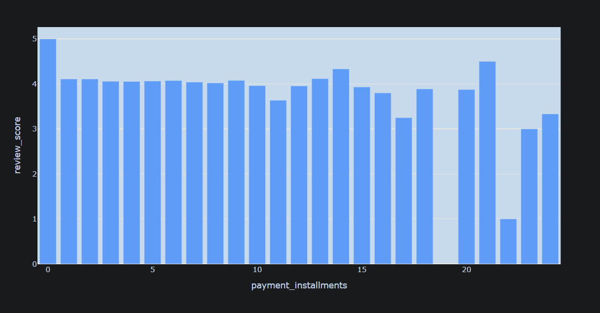

### Dashboard 4
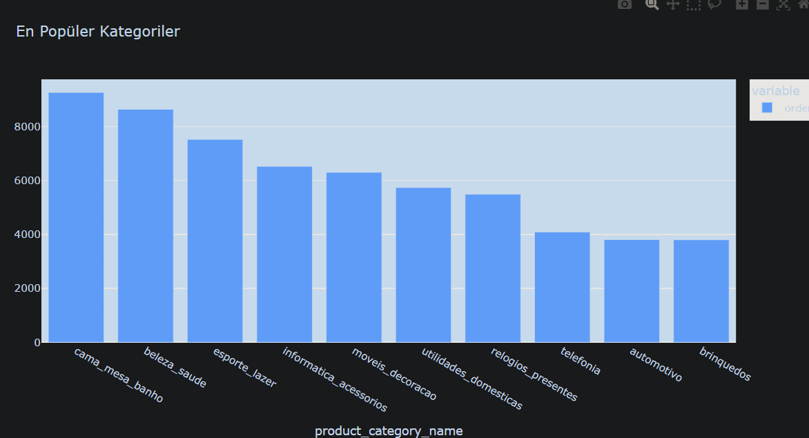

### Dashboard 5
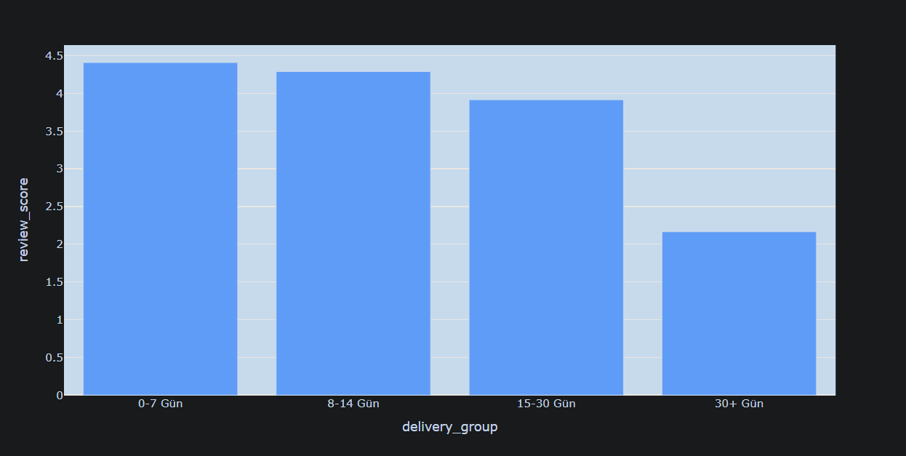

### Dashboard 6
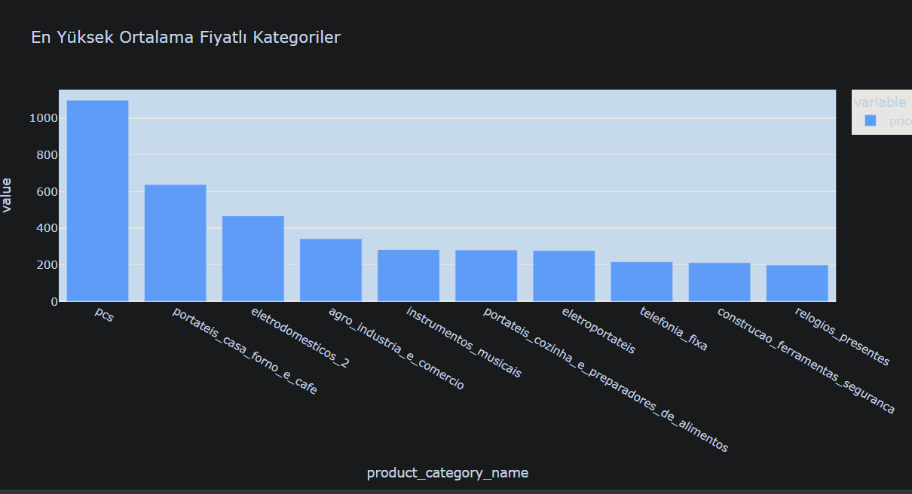

### Dashboard 7
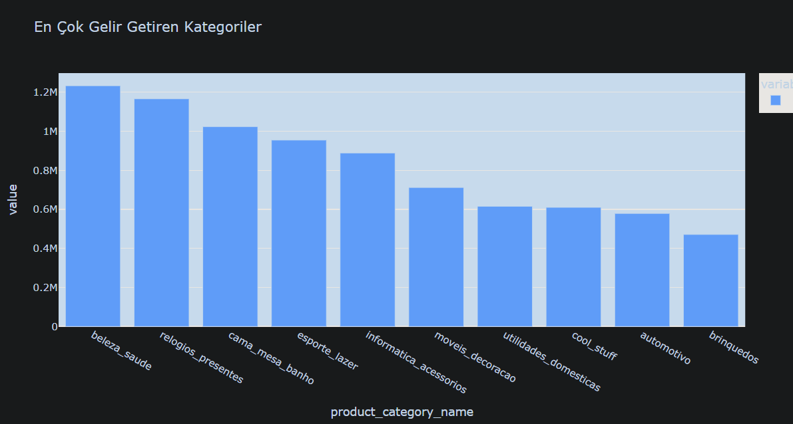

### Dashboard 8
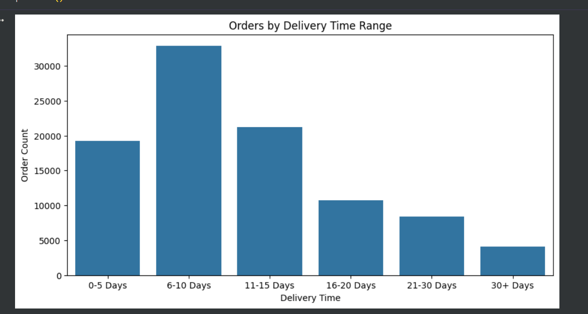

### Dashboard 9
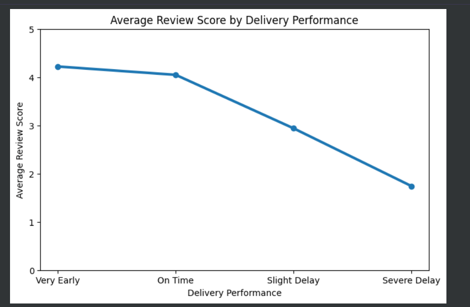

### Dashboard 10
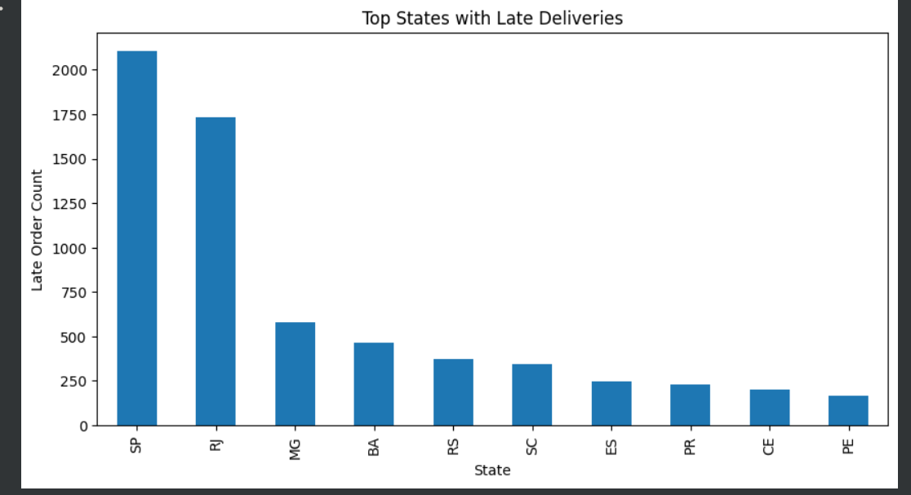

### Dashboard 11
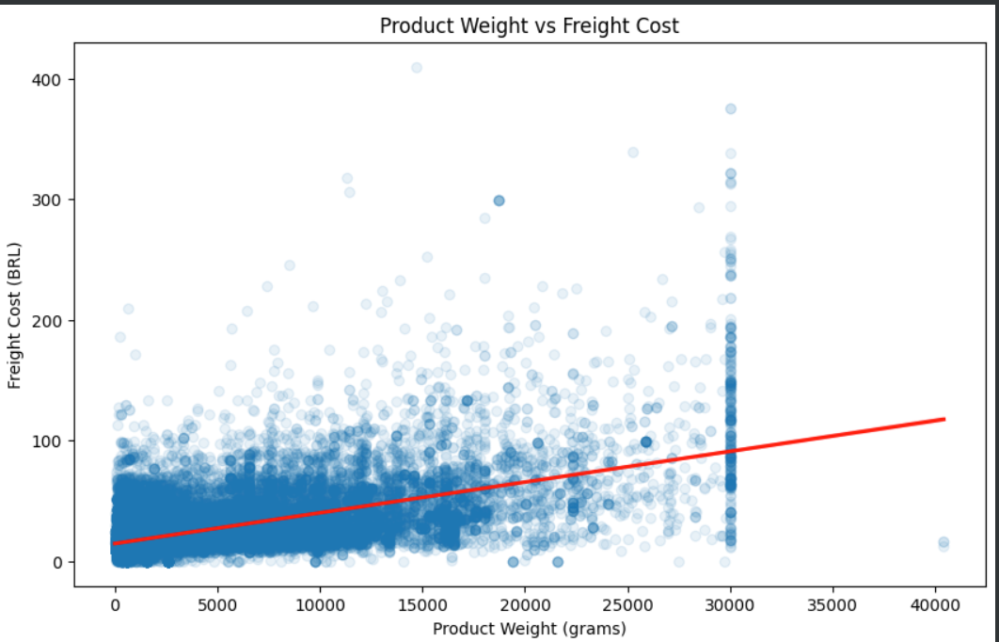

### Dashboard 12
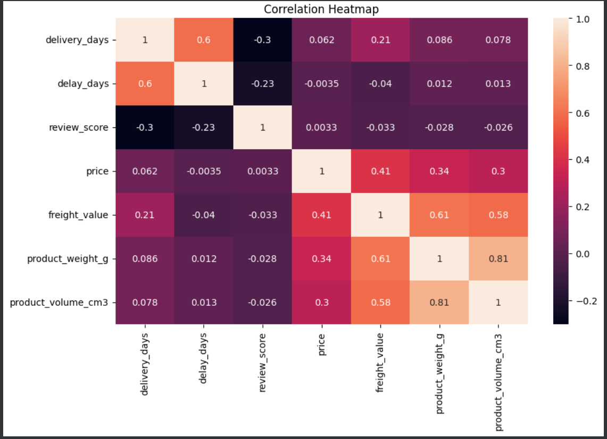

### Dashboard 13
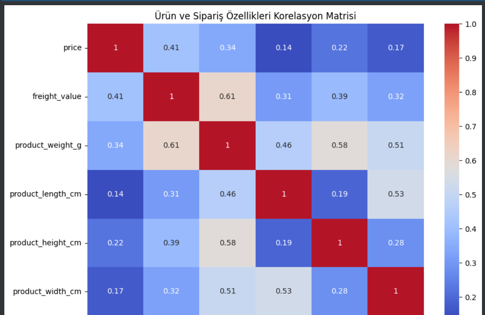

Dashboard screenshots are also available in the Images folder: [View Screenshots](images/)

